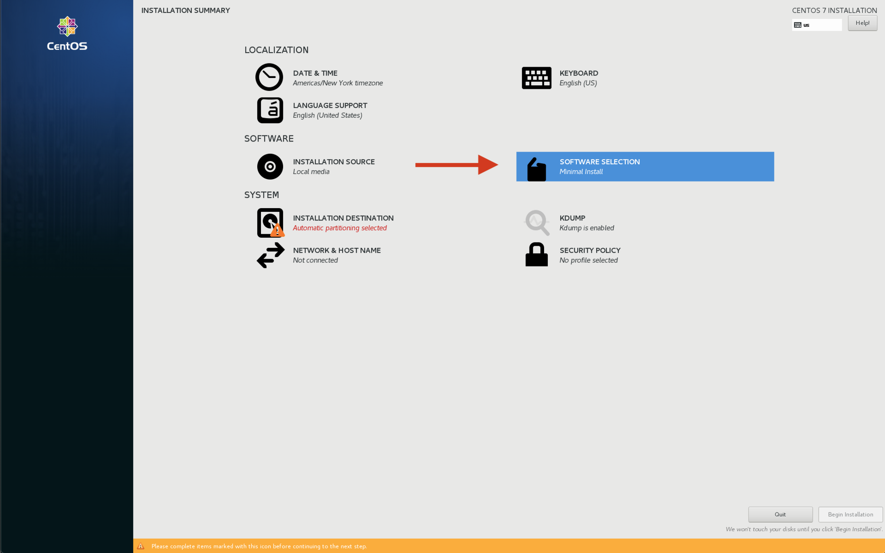
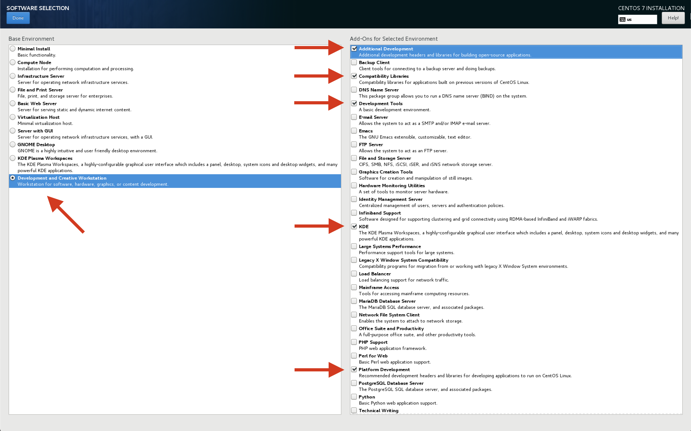

# 在 CentOS 7 上使用 QGC

## 安装操作系统

安装CentOS 7

1. 从这里获取最新[CentOS 7 ISO ](http://isoredirect.centos.org/centos/7/isos/x86_64/CentOS-7-x86_64-DVD-1810.iso)
2. 通过[following this guide](https://linuxize.com/post/how-to-create-a-bootable-centos-7-usb-stick/)制作一个 USB 启动盘。
3. 从USB启动盘中启动目标设备。

下面的示例将说明如何从USB启动盘启动目标设备。

**Example：** *Panasonic Toughpad FZ-M1* （为方便遵循本指南操作，建议在设备上附上一个键盘和鼠标）。

1. 在附加的 USB 键盘上按住 **Delete** 键，或者在启动时按下电源按钮周围的所有按钮，便可进入BIOS 菜单。
2. 在 BIOS 菜单界面使用箭头键或触摸屏切换到 *Exit* 选项卡。
3. 从启动设备列表中，选择已插入的USB启动盘。

**Example** [UAV 组件微导航](https://www.uavcomp.com/command-control/micronav/) 设备：

1. CentOS 不会以默认配置安装。 为解决这个问题，可进行如下操作： 
    1. 如上述的示例中所述，转到BIOS菜单。
    2. 在“Advanced”选项卡下禁用“Extension Port”设备。
    3. 在BIOS菜单的退出页面上选择“Exit and save”，然后从USB启动盘启动目标设备。
    4. 在 CentOS 安装成功后，可再次恢复更改，以便微硬网络正常工作。
2. 如果想要重新进入Linux操作系统，请先关闭设备，而不是热重启。 否则微硬网络适配器将无法正常工作并怠速整个系统。

### CentOS 软件选择安装选项

这些都是用于安装CentOS开发系统的选项。 使用它作为指南。





### 更新 GStreamer

CentOS 安装并启动后，我们需要为QGC 搭建环境。 首先，我们需要将GStreamer更新为最新版本。 本指南遵循Alice Wonder的提示：https://media.librelamp.com。

    sudo yum install epel-release -y
    wget http://awel.domblogger.net/7/media/x86_64/awel-media-release-7-6.noarch.rpm
    sudo yum localinstall awel-media-release-7-6. orarch.rpm -y
    sudo yum clearing all
    sudo yum update
    sudo yum install gstreamer1* --skip-break-y
    

**Note:**确保如下组件已安装 (Intel GPUs的 vaapi)

    sudo yum install gstreamer1-vaapi
    sudo yum install gstreamer1-libav
    

### 安装SDL2

SDL2 用于游戏杆支持。

    sudo yum install SDL2 SDL2-devel -y
    

### 更新内核(可选)

> **Tip**当运行命令`/dev/input/*` 时， 如果游戏杆被成功识别并显示为`/dev/input/js0` ，则可以跳过这一步。

我们建议更新内核的原因为：

- 更好地触摸屏幕响应性能。
- 正确识别某些USB设备 - 特别是游戏杆。

下面的游戏杆已确信无法用默认的 CentOS 7 内核(3.10.0):

- Logitech F310
- Microsoft Xbox 360 controller (USB)

要修复无法识别的游戏杆(即使在Windows或Ubuntu可正常工作)，请[遵循本指南更新内核](https://www.howtoforge.com/tutorial/how-to-upgrade-kernel-in-centos-7-server/)。

更新内核需要执行的命令简短摘要如下：

    sudo rpm --importer https://www.elrepo.org/RPM-GPG-KEY-elrepo.org
    sudo rpm -Uvh http://www.elrepo.org/elrepo-release-7.0-2.el7.elrepo.noarch.rpm
    sudo yum --enablerepo=elrepo-kernel install kernel-ml -y
    

成功执行上述命令后，重启设备，并确保新的内核版本与启动时GRUB菜单中的默认起始选项一致。

> **Note** 您可能需要在 BIOS 中禁用安全启动才能启动新内核。

## 在 CentOS 上运行 QGC

在启动 QGC 之前，您需要确保当前用户可以访问拨号组 (串行端口访问权限)：

    shsudo usermod -a -G dialout $USER
    

### 防火墙

CentOS作为 Red Hat的分发版本，其默认防火墙安全级别会 阻止MAVLink通讯和摄像头视频流。 因此，需要创建规则来打开传入端口的 MAVLink 和相机流。 仅为非生产性的本地环境测试目的，您可以使用以下命令暂时禁用防火墙 ([从这里](https://www.liquidweb.com/kb/how-to-stop-and-disable-firewalld-on-centos-7/))：

临时

    systemctl stop firewalld
    

永久性(风险自负)：

    systemctl disable firewalld
    

撤销永久更改：

    systemctl stop firewalld
    

### 与多网络的连接问题

在 CentOS 测试中，即使有适当的IP地址和子网分配，在通过多个网络设备连接到多个网络时依然遇到了一些问题，。

问题包括：

- 连接到第二个网络时失去互联网连接
- 与载具的连接质量不佳，存在有大量不确定非再现问题和包丢失（例如，在常规模式中， 30秒完美连接，4秒丢失数据包)

如果遇到以上任一问题，一次只连接一个网络，即可规避问题（例如，在WiFi和Microhard之间切换）。

### 执行预构建的 QGC 二进制文件

- 为CentOS保留包含预构建的QGC二进制文件的归档。 目前，这个构建没有自动部署，如果您迫切需要，请与开发者取得联系，。
- [解压归档](https://www.hostdime.com/kb/hd/command-line/how-to-tar-untar-and-zip-files)
- 从解压文件里找到脚本文件`qgroundcontrol-run.sh`
- 输入如下命令，运行该脚本

      ./qgroundcontroll-run.sh
      ```
    
    ## Building QGC on CentOS
    
    ### 安装 Qt
    

mkdir ~/devel cd ~/devel

    <br />从 Qt 安装脚本安装 Qt 5.12.4 ，可以从此链接下载所需文件 [here](https://www.qt.io/download-thank-you?os=linux&hsLang=en)。
    下载完毕后，输入如下指令，即可执行安装文件，并运行Qt：
    

chmod +x qt-unified-linux-x64-3.1-online.run ./qt-unified-linux-x64-3.1-online.run

    <br />选择以下选项并在“~/devel/Qt`下安装它：
    
    
    
    ### 克隆并构建 QGC
    
    

git clone --recursive https://github.com/mavlink/qgroundcontrol.git mkdir build cd building

    调试/测试版本构建：
    

../Qt/5.12.4/gcc_64/bin/qmake ../qgroundcontrol/qgroundcontrol.pro -spec linux-g++ CONFIG+=debug

    发行版本构建：
    

../Qt/5.12.4/gcc_64/bin/qmake ../qgroundcontrol/qgroundcontrol.pr-spec linux-g++ CONFIG+=qtquickcompiler

    构建
    

make -j4 ```

您也可以先启动*QtCreator* (在 `~/devel/Qt/Tools/QtCreator/bin/qtcreator`目录下)，然后从IDE之中打开`qgroundContro.pro` 项目，构建build版和debug版 。

默认情况下，这将构建常规的 QGC。 请参阅[这些说明](https://github.com/mavlink/qgroundcontrol/blob/master/custom-example/README.md)，构建样本，并自定义UI版本